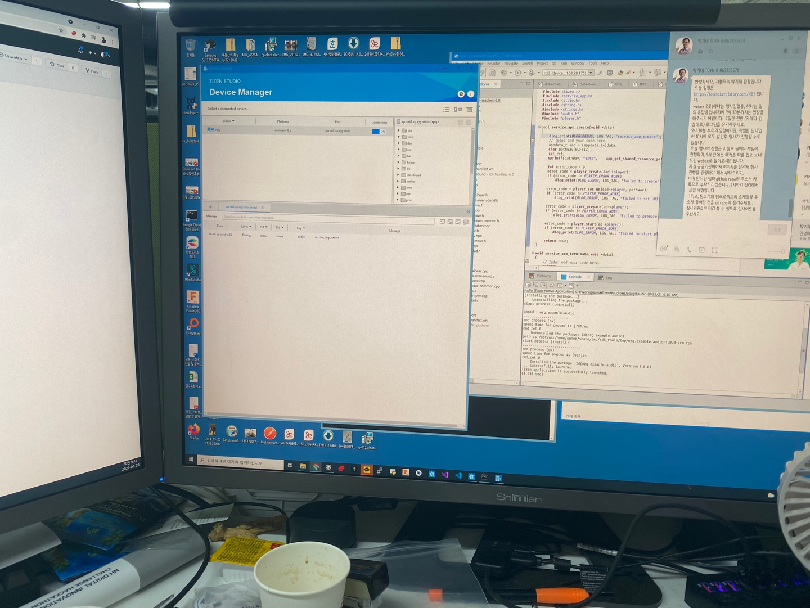
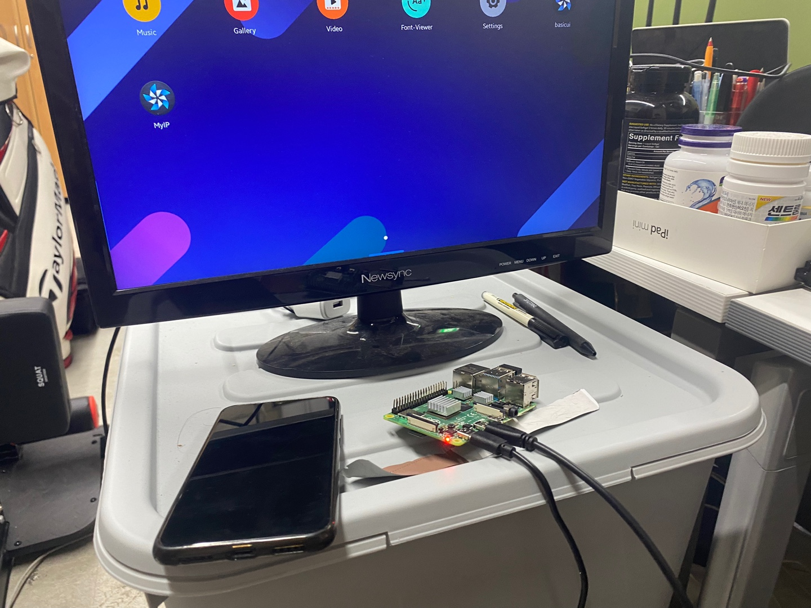
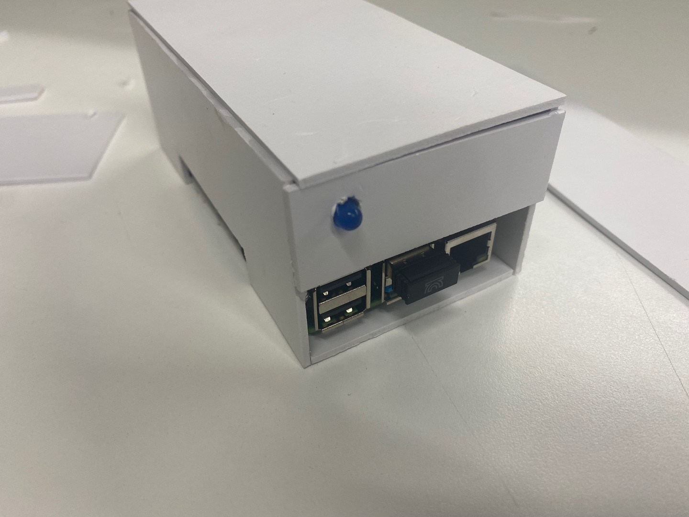
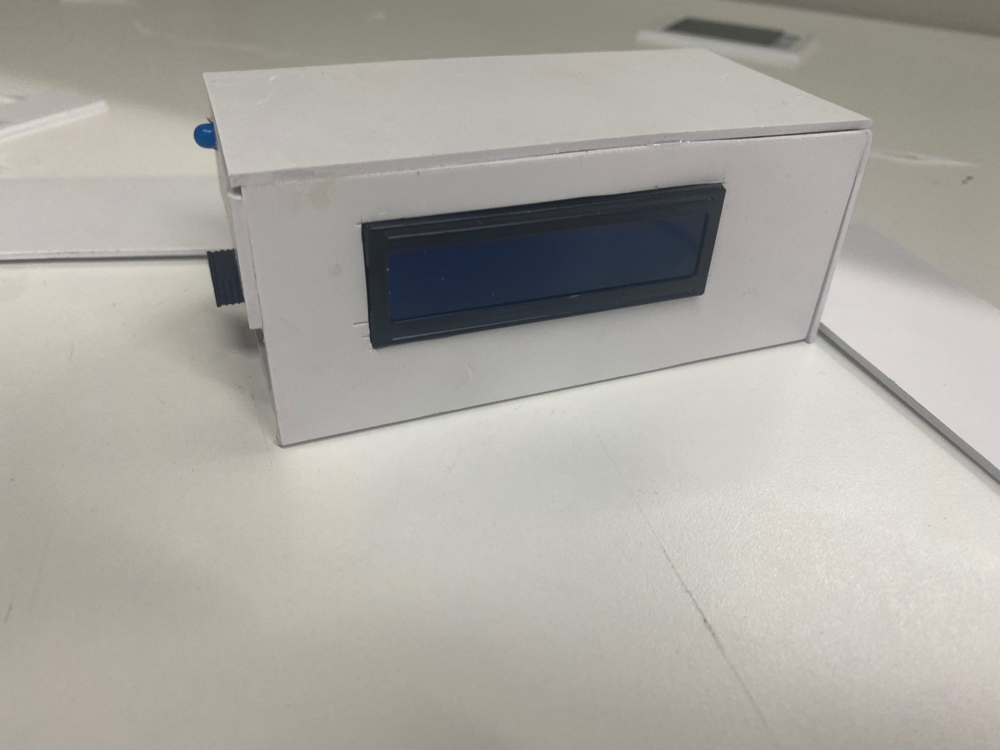
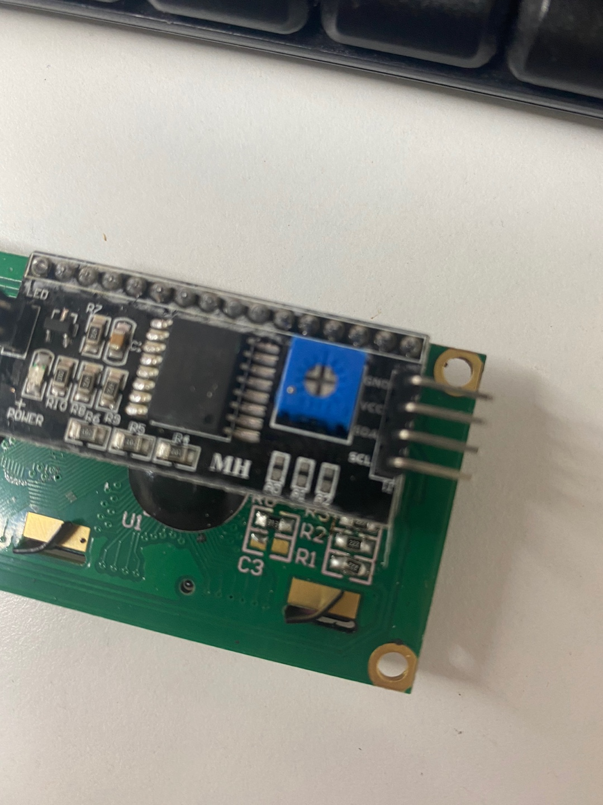
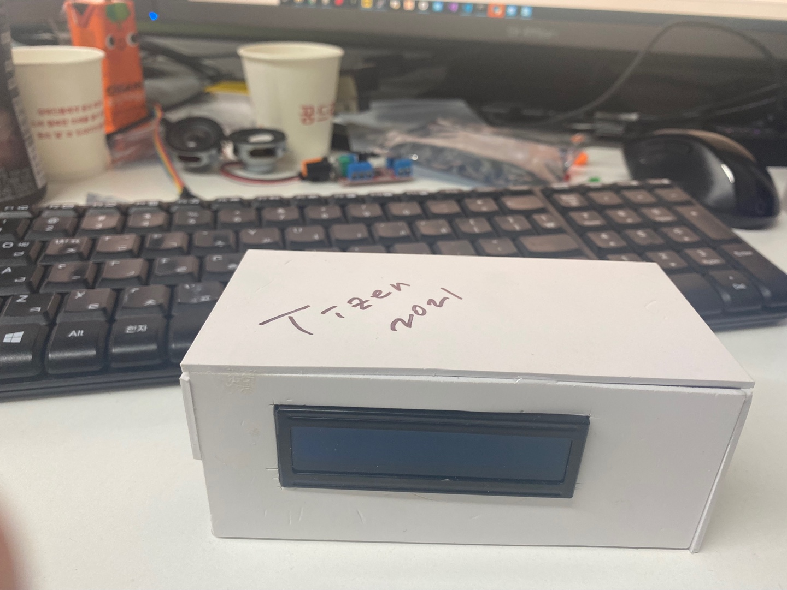
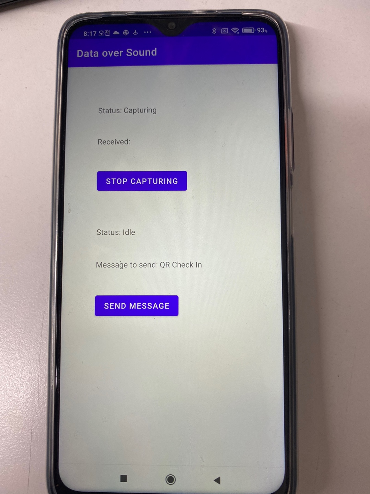
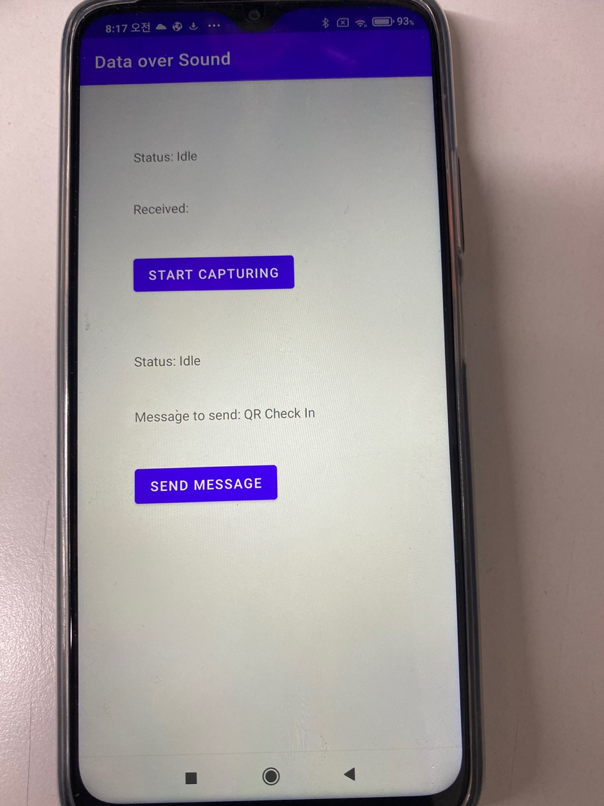

# (2021)온라인 서울 하드웨어 해커톤 - 탑메이커편
---
1. [팀명 및 팀원](#팀명-및-팀원)
2. [프로젝트 제목](#프로젝트-제목) 
3. [프로젝트 배경 및 목적](#프로젝트-배경-및-목적)
4. [타이젠 오픈소스에 컨트리뷰션한 내역](#타이젠-오픈소스에-컨트리뷰션한-내역)
5. [파일리스트](#파일리스트)
6. [코드 기여자](#코드-기여자)
7. [보드](#보드)
8. [구현 사항 가산점](#구현-사항-가산점)

[별첨](#별첨)

---

## 팀명 및 팀원
- 팀명: WNB
- 팀원 
   
이름|역할
---|---
황해연|기획/설계/개발(하드웨어/소프트웨어)
김민전|개발(소프트웨어)
황인규|기획/테스트
황인후|테스트

---

## 프로젝트 제목

**에어코드를 이용한 QR체크인 (QR check-in w/ Air Code)**

---

## 프로젝트 배경 및 목적 
#### 배경
- 코로나 이후 주변에서 흔하게 QR체크인을 통해서 오프라인 사용자의 동선을 체크 함.
- 동선을 체크하기 위한 QR코드 체크인의 과정이 의외로 복잡한 단계를 거침
    - 휴대폰/앱 활성화 – 서비스 찾기 – QR발급 – QR인식 (리더기해상도에 따라 더 늦어짐)
    - 공연장 및 전시장과 같은 경우에는 구획별 파티션마다 QR체크인 수행
    - 언택트 기술의 일부인 음성통신을 이용한 QR체크인 활성화 기술

#### 하고자 하는것
- QR 체크인이 필요한 상황에서 알아서 체크인 코드가 활성화
- **에어코드를 이용한 QR체크인**

#### 실현가능성
- 실제 통신 데이터를 저대역 PCM(디지털 양자/부호화)
- 이를 오디오 내 추출 및 삽입을 통해 데이터의 통신구현이 가능할 것으로 보임
- QR 리더기 근처에 저대역/저음 송출이 가능한 스피커와 본체를 구현하여
- 마이크로 단위의 위치기반 서비스와 데이터 전송이 가능함.

- **음성통신을 이용한 실내외 위치기반 다양한 마이크로 서비스 가능 => 광고/방역/위치서비스 등**

---

## 타이젠 오픈소스에 컨트리뷰션한 내역
내역없음

---

## 파일리스트
  
#### 에어코드 발신 장치 (타이젠) [[github]](https://github.com/pushdown99/aircode/tree/main/data-over-sound)
~~~console
├─data-over-sound
│  ├─inc
│  ├─shared
│  │  └─res
│  └─src
~~~

- 헤더파일(*.h *.hpp)

파일명|내용
---|---
inc/data-over-sound.h|에어코드 외부참조 변수 및 함수정의
inc/data2wav.h|WAV파일 생성
inc/dr_wav.h|WAV(from PCM) 파일생성을 위한 외부참조 변수 및 함수정의 (외부 오픈소스)
inc/gf.hpp|Binary Polynomials 테이블 전처리 (외부 오픈소스)
inc/ggwave-common.h|ggwave 관련 공통 외부참조 변수 및 함수정의
inc/indicators.hpp|커맨드라인 진행처리 관련 외부참조 변수 및 함수정의
inc/lcd.h|LCD 관련 외부참조 변수 및 함수정의
inc/LiquidCrystal_I2C.h|LuquidCrystal I2C 처리를 위한 아두이노 외부참조 변수 및 함수정의 (외부 오픈소스)
inc/misc.h|기타 Miscellaneous 외부참조 변수 및 함수정의
inc/poly.hpp|Polynomial 부호 전처리 (외부 오픈소스)
inc/resampler.h|샘플러를 위한 클래스 정의
inc/rs.hpp|Reed-Solmon Error Correction 전처리 (외부 오픈소스)
inc/thread.h|쓰레드 처리를 위한 외부참조 변수 및 함수정의

- 소스파일(*.c *cpp)

파일명|내용
---|---
src/data-over-sound.c|에어코드 외부참조 변수 및 함수정의
src/data2wav.cpp|WAV파일 생성
src/ggwave-common.cpp|ggwave 관련 공통 라이브러리 (외부오픈소스)
src/ggwave.cpp|ggwave 라이브러리 (외부오픈소스)
src/lcd.cpp|LCD 관련 함수 구현
src/LiquidCrystal_I2C.cpp|LuquidCrystal I2C 처리를 위한 아두이노 함수 라이브러리 (외부 오픈소스)
src/misc.c|기타 Miscellaneous 함수 구현
src/resampler.cpp|샘플러를 위한 클래스 함수 구현
src/thread.c|쓰레드 처리를 위한 함수 구현

#### 에어코드 수신/QR체크인 (안드로이드) [[github]](https://github.com/pushdown99/aircode/tree/main/android/app)

~~~console
├─src
│  ├─main
│  │  └─cpp
│  │   |  └─ggwave
│  │  └─java/com/example/ggwave
│  │  └─cpp
~~~

- 소스파일(*.java)

파일명|내용
---|---
java/com/example/ggwave/**MainActivity.java**|메인액티비티 함수 구현 (에어태크인지 및 QR 체크인 인덴트호출)  

- 소스파일(*.cpp *.h)

파일명|내용
---|---
cpp/test-cpp.h|CPP 라이브러리 JAVA 호출을 위한 JNI 함수 정의
cpp/test-cpp.cpp|CPP 라이브러리 JAVA 호출을 위한 JNI 함수 구현
cpp/ggwave/*|ggwave 라이브러리

---

## 코드 기여자 

#### 에어코드 발신 장치 (타이젠)

- 헤더파일(*.h)

파일명|기여자
---|---
inc/data-over-sound.h|황해연
inc/data2wav.h|황해연
inc/lcd.h|황해연
inc/misc.h|황해연
inc/thread.h|황해연

- 소스파일(*.c)

파일명|내용
---|---
src/data-over-sound.c|황해연
src/data2wav.cpp|황해연
src/lcd.cpp|황해연
src/misc.c|황해연
src/thread.c|황해연

#### 에어코드 수신/QR체크인 (안드로이드)

파일명|기여자
---|---
java/com/example/ggwave/**MainActivity.java**|김민전  
cpp/test-cpp.h|김민전
cpp/test-cpp.cpp|김민전

---

## 보드 

구현보드|목적|소스위치
:---|:---|:---
RPi 4|에어코드 발신장치 - 에어코드발신 - 발신상태송출|[https://github.com/pushdown99/aircode/tree/main/data-over-sound](https://github.com/pushdown99/aircode/tree/main/data-over-sound)  

---

## 구현 사항 (가산점) 

#### Peripheral
종류|디바이스|목적|소스위치
:---|:---|:---|:---
I2C|16x2 LCD 모듈|발신상태송출|src/lcd.c src/LiquidCrystal_I2C.cpp(포팅)
GPIO|LED|발신상태송출|src/thread.c

---

## 별첨

#### 자료다운로드
Output|Download
---|---
발표자료|[README.md](README.md)
